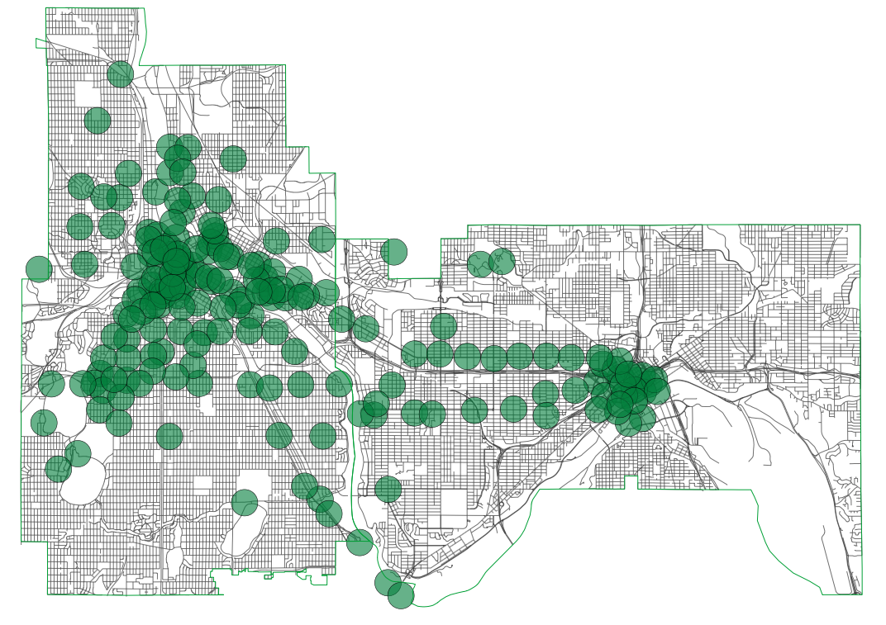

# Niceride coverage for .25 mi walking distance

Mostly just posting all the crap I used to make this for future reference.
`Makefile` contains a lot of insanity, as does the rest of it. Post an issue
with questions, maybe I'll help.
